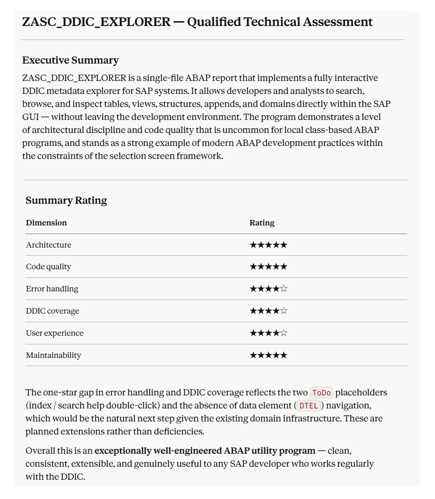

# 🚀 Advanced DDIC Explorer for SAP (ABAP 7.40 SP08+)

*The Image shows the PRO version user interface with advanced relationship analytics (check tables, indices, search helps)*

*The export function (comes soon) is only available in the PRO version*

*Claude - PRO version - Qualified Technical Assessment 2026/06/01*

Tired of the endless window-switching and click-marathons in standard SAP `SE11`? This tool is a modern, high-productivity dictionary viewer designed right inside the SAP GUI using a clean, native ALV layout.

Analyze structures, text tables, active database indices, and search helps for an UNLIMITED number of DDIC objects simultaneously. Fully optimized for modern SAP S/4HANA environments (e.g., complex objects like Central Business Partner `BUT000`).

---

## 📺 Video Documentation & Step-by-Step Manuals

To make your onboarding seamless and show the engine in action under real-world corporate conditions, we provide a high-quality technical video series. No boring slides, no corporate fluff - just pure SAP GUI screen recordings guiding you through every advanced feature of the tool.

▶️ **[Access the Official YouTube Channel & Watch All Manuals](https://www.youtube.com/@Andy-Stier)**

### Inside the video library, you will find detailed guides on:
* **Bulk Selections & Search Filters** – Mastering dynamic fields and language switching.
* **Bulk Search by Table Description** – High-speed text processing driven by native `CP`/`NP` compiler performance.
* **Deep Table Fields Analysis** – Schema investigation and structural breakdowns.
* **And many more...**

*Feel free to subscribe to the channel to never miss upcoming technical upgrades and release notes! 🔔*

---

## ⚡ Installation & Deployment

You can install the **Advanced DDIC Explorer** either as a classic single-file report or automate it completely via **abapGit**.

### Option A: Automated Installation via abapGit (Recommended)
1. Open the **abapGit** developer tool in your SAP system.
2. Click on **+ Online** to create a new online repository.
3. Paste the URL of this GitHub repository: `https://github.com/Andy-Stier/advanced-ddic-explorer.git`
4. Specify your target package (e.g., `$Z_DDIC_EXPLORER`) and folder logic.
5. Click **Clone Repository**, then select **Pull** to automatically deploy and activate the code in your system.

### Option B: Classic Single-File Copy-Paste
1. Open your SAP system and go to transaction `SE38` or `SE80`.
2. Create a new executable program (e.g., `Z_ADVANCED_DDIC_EXPLORER`).
3. Open the file `src/zasc_ddic_explorer_free.prog.abap` from this repository and copy the entire source code.
4. Paste the code into your SAP report, activate it (`Ctrl+F3`), and run it (`F8`).

*Baseline Compatibility: 100% compatible down to ABAP 7.40 and fully S/4HANA-ready!*

---

## 📄 License
The Free version of this software is licensed under the [MIT License](LICENSE). You are free to use, modify, and distribute the base version within your corporate landscape.
