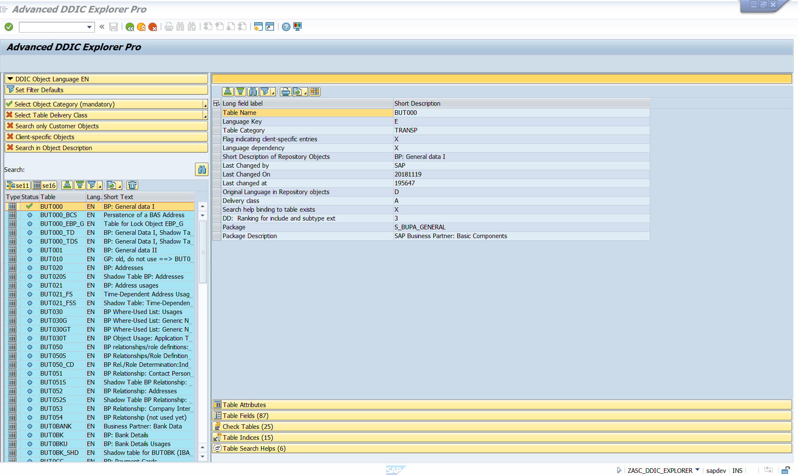
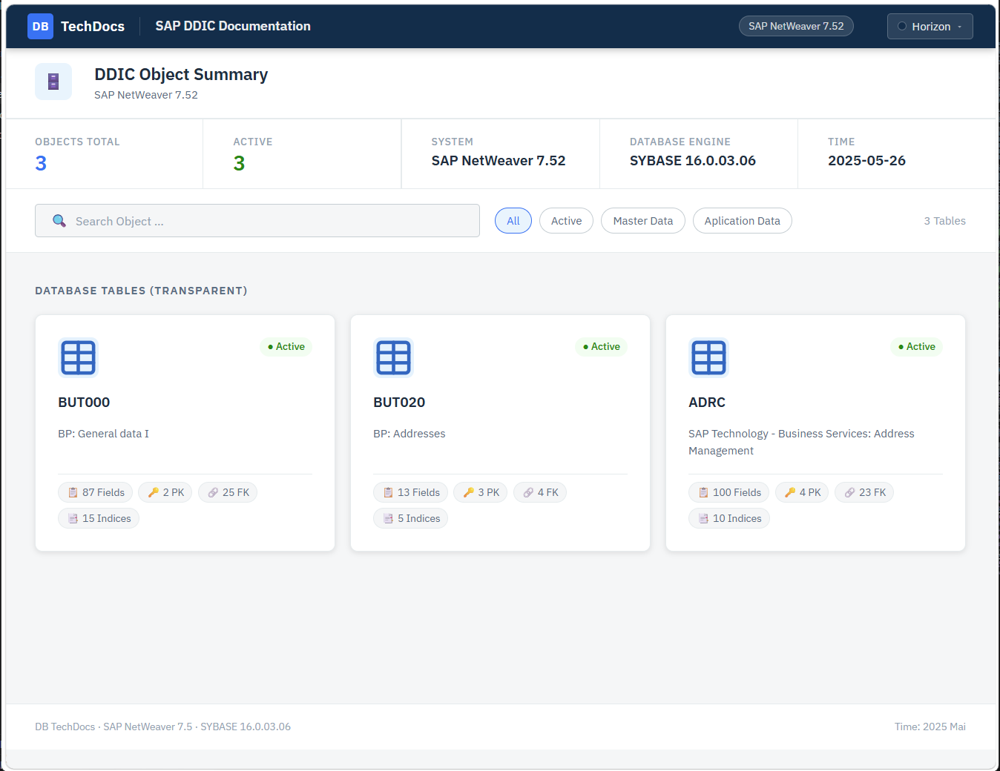
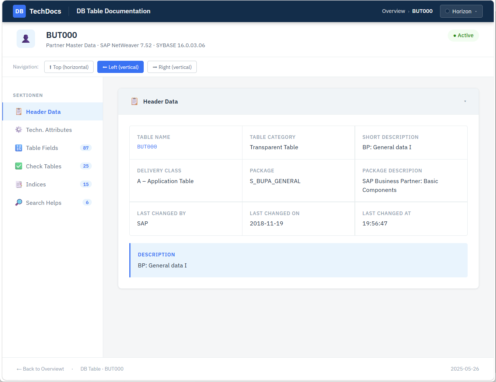

# 🚀 Advanced DDIC Explorer for SAP (ABAP 7.40+)

### 📢 COMMUNITY NOTICE: OPEN BETA & EXTENDED TESTING PHASE
The Free Open-Source Version is now officially **LIVE and ready for testing**! To ensure the absolute highest stability and performance down to ABAP 7.40, the commercial PRO Launch and the upcoming €9.99 Flash Sale have been **intentionally shifted**.

We want the SAP community to test this tool thoroughly in your sandbox and development systems without any pressure.
* Found a bug or compatibility issue on your specific S/4HANA release? Open a **GitHub Issue**!
* Have ideas or general feedback? Join the **GitHub Discussions**!

*The priority whitelist for everyone who commented "FLASH" on LinkedIn remains 100% active and locked in.* 😉

*The Image shows the PRO version user interface with advanced relationship analytics (check tables, indices, search helps)*

*The export function (comes soon) is only available in the PRO version*

Tired of the endless window-switching and click-marathons in standard SAP `SE11`? This tool is a modern, high-productivity dictionary viewer designed right inside the SAP GUI using a clean, native ALV layout.

Analyze structures, text tables, active database indices, and search helps for an UNLIMITED number of DDIC objects simultaneously. Fully optimized for modern SAP S/4HANA environments (e.g., complex objects like Central Business Partner `BUT000`).

---

## 💡 Free vs. Pro Feature Matrix

| Feature                                                               | FREE Version (Open Source) | PRO Version (Commercial) |
| :---| :---: | :---: |
| 🎯**Unlimited Bulk Query** (Multiple tables at once)                  | ✅                         | ✅                      |
| 🎯**ALV Interface** (Modern layout)                                   | ✅                         | ✅                      |
| 🎯**Smart Filtering** (By category, delivery class, Z/Y objects)      | ✅                         | ✅                      |
| 🎯**Wildcard Text Search** (Utilizing ABAP `CP` operator on `DD02T`)  | ✅                         | ✅                      |
| 🎯**Smart Multi-Language Support** (Language-independent)             | ✅                         | ✅                      |
| 💎**Check Table Analyzer** (Foreign-key mapping)                      | ❌                         | ✅                      | 
| 💎**Active DB Indices & Search Helps** (Performance tuning)           | ❌                         | ✅                      |
| 💎**Fiori-Style HTML Export** *(Coming soon / Free Upgrade)*          | ❌                         | ✅                      |
| 💎**Technical Support & 12 Months Updates**                           | ❌                         | ✅                      |

---

## ⚡ Installation & Deployment

You can install the **Advanced DDIC Explorer** either as a classic single-file report or automate it completely via **abapGit**.

### Option A: Automated Installation via abapGit (Recommended)
1. Open the **abapGit** developer tool in your SAP system.
2. Click on **+ Online** to create a new online repository.
3. Paste the URL of this GitHub repository: `https://github.com/Andy-Stier/advanced-ddic-explorer.git`
4. Specify your target package (e.g., `$Z_DDIC_EXPLORER`) and folder logic.
5. Click **Clone Repository**, then select **Pull** to automatically deploy and activate the code in your system.

### Option B: Classic Single-File Copy-Paste
1. Open your SAP system and go to transaction `SE38` or `SE80`.
2. Create a new executable program (e.g., `Z_ADVANCED_DDIC_EXPLORER`).
3. Open the file `src/zasc_ddic_explorer_free.prog.abap` from this repository and copy the entire source code.
4. Paste the code into your SAP report, activate it (`Ctrl+F3`), and run it (`F8`).

*Baseline Compatibility: 100% compatible down to ABAP 7.40 and fully S/4HANA-ready!*

---

## 💎 Commercial Licensing & Support

The **PRO Version** unlocks deep architectural insights and database performance tuning parameters with a single click. All commercial licenses include **12 months of free updates** (including the upcoming Fiori-Style HTML Export upgrade) and technical support.

🔥 **BONUS ROADMAP VALUE:** The upcoming **Fiori-Style HTML Export upgrade** (launching in 1–3 months) is fully included in your 12-month update window. Buy today, and receive the HTML Export feature as a **FREE automatic update** later!

### 🎟️ Upcoming PRO Launch Pricing (Soon)
The commercial store is currently closed while the community thoroughly tests the Free Version. Once the store opens, the following tiers will apply:

| Licence | Price | Benefit |
| :--- | ---: | :---|
|**Pro Single User:**| €99.00 | - |
|**Pro Small Team** (Up to 5 developers)| €399.00  | *Get 5 licences for the price of 4!*|
|**Pro Large Team** (Up to 10 developers)| €699.00  | *Save nearly 30%* |
|**Enterprise Site License:**| Custom pricing | *up for negotiable* |

---

## 📄 License
The Free version of this software is licensed under the [MIT License](LICENSE). You are free to use, modify, and distribute the base version within your corporate landscape.
