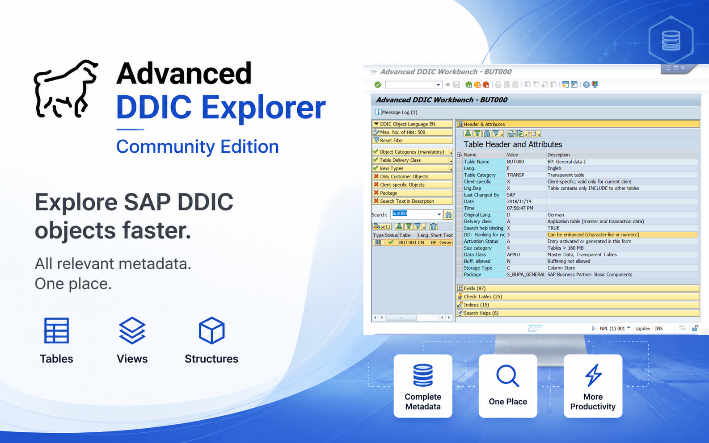

# Advanced DDIC Explorer for SAP (ABAP 7.40 SP08+)

### SAP Metadata & Impact Analysis Platform
Advanced DDIC Explorer helps ABAP developers explore and understand complex SAP metadata from a single, easy-to-use tool.

*Explore. Understand. Document.*

✔ ABAP 7.40 SP08+
✔ Single-file deployment
✔ S/4HANA ready
✔ Open Source Community Edition (MIT)

### Explore
- Quickly find any SAP DDIC object (tables, views, structures)
- Navigate complex metadata in seconds
- Explore relationships between SAP tables

### Understand
- Understand unfamiliar SAP standard and custom objects within minutes
- Analyze DDIC objects in depth (header, fields, foreign keys, indexes, search helps, text tables)
- Reduce the time required to understand legacy developments

### Build Knowledge
- Build the foundation for technical documentation
- Prepare DDIC metadata for further analysis
- Accelerate onboarding for new developers

## Why Advanced DDIC Explorer?

* SAP provides metadata
* Advanced DDIC Explorer transforms metadata into actionable knowledge.

## Included Features
* **Full Search & Filter** 
* **Header & Attributes**
* **Fields**
* **Text Table**
* **Check Tables**
* **Indexes**
* **Search Helps**

### Installation & Deployment

You can install the **Advanced DDIC Explorer** either as a classic single-file report or automate it completely via **abapGit**.

#### Option A: Automated Installation via abapGit (Recommended)
1. Open the **abapGit** developer tool in your SAP system.
2. Click on **+ Online** to create a new online repository.
3. Paste the URL of this GitHub repository: `https://github.com/Andy-Stier/advanced-ddic-explorer.git`
4. Specify your target package (e.g., `$Z_DDIC_EXPLORER`) and folder logic.
5. Click **Clone Repository**, then select **Pull** to automatically deploy and activate the code in your system.

#### Option B: Classic Single-File Copy-Paste
1. Open your SAP system and go to transaction `SE38` or `SE80`.
2. Create a new executable program (e.g., `Z_DDIC_EXPLORER`).
3. Open the file `src/zasc_ddic_explorer_free.prog.abap` from this repository and copy the entire source code.
4. Paste the code into your SAP report, activate it (`Ctrl+F3`), and run it (`F8`).

*Baseline Compatibility: 100% compatible down to ABAP 7.40 and fully S/4HANA-ready!*

## Professional Modules
Additional modules extend the platform with advanced documentation, impact analysis and automation capabilities.

|Module |	Status |
| :---| :--- |
| **HTML Documentation** |	✅ Available|
| **Impact Analysis** |	✅ Available|
| **SQL Builder** |	🚧 Planned, 2026|
| **OData Metadata Generator** |	🚧 Planned, 2026|
| **SuccessFactors OData Explorer** |	🚧 Planned, 2027 |

## 📺 Video Documentation & Step-by-Step Manuals

Watch short technical videos covering installation, real-world use cases and new features.

▶️ **[Access the Official YouTube Channel & Watch All Manuals](https://www.youtube.com/@Andy-Stier)**

*Feel free to subscribe to the channel to never miss upcoming technical upgrades and release notes! 🔔*

## Feedback & Ideas: 
Feedback is welcome! Please use GitHub Discussion: [Feedback & Ideas for the Community Edition](https://github.com/Andy-Stier/advanced-ddic-explorer/discussions/2)

## Contact
E-Mail: advanced.abap.software@gmail.com

## License
The Community version of this software is licensed under the [MIT License](LICENSE). You are free to use, modify, and distribute the base version within your corporate landscape.
